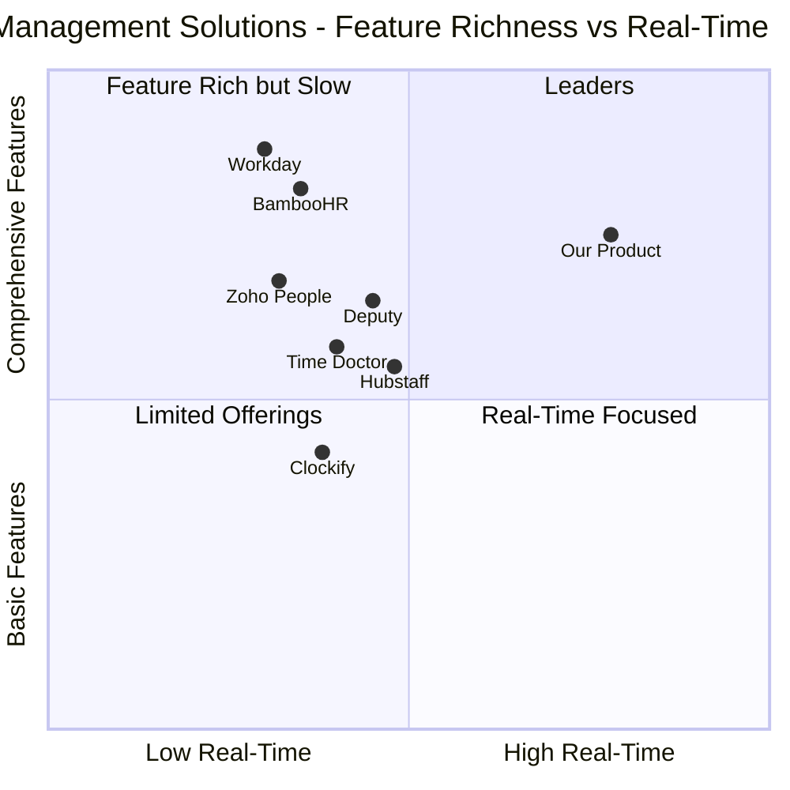

# Product Requirements Document (PRD)

# Attendance & Workforce Management System

## Document Information

- **Project Name**: attendance_workforce_management
- **Version**: 1.0
- **Date**: 2025-10-24
- **Language**: English
- **Programming Stack**: Next.js 14+ (App Router), TypeScript, Convex, Tailwind CSS, shadcn/ui

---

## 1. Executive Summary

### 1.1 Original Requirements

Build a full-stack Attendance & Workforce Management system for a software house using Next.js (App Router) + TypeScript on the frontend and Convex as the ONLY backend. The system must track attendance with real-time clock-in/out, face verification, remote work tracking (location/IP/device), leave management, projects, and tasks. Support three roles: Admin, Manager, and Employee with real-time UI updates, optimistic updates, and offline-first basics where possible.

### 1.2 Product Vision

Create a modern, privacy-conscious workforce management platform that seamlessly integrates attendance tracking, biometric verification, project management, and leave administration in a single real-time application. The system prioritizes user privacy, especially regarding biometric data, while providing comprehensive workforce insights for administrators.

---

## 2. Product Goals

1. **Real-Time Workforce Visibility**: Provide instant, accurate visibility into who is working, where they are working, and what they are working on, with live updates across all connected clients.

2. **Privacy-First Biometric Authentication**: Implement secure face verification that stores only mathematical embeddings (not raw images), with explicit user consent, transparency, and deletion capabilities compliant with biometric privacy regulations.

3. **Unified Workforce Operations**: Consolidate attendance tracking, leave management, project/task management, and time logging into a single cohesive platform that eliminates data silos and reduces administrative overhead.

---

## 3. User Stories

### 3.1 Employee Stories

- **As an employee**, I want to clock in/out with a single click and see my running timer in real-time, so that I can accurately track my work hours without manual calculations.
- **As an employee**, I want to enroll my face biometric data with clear consent and understanding of how it's stored, so that I can use convenient face verification while maintaining control over my privacy.
- **As a remote employee**, I want to clock in from any location and have the system automatically detect if I'm working remotely, so that my work is tracked accurately regardless of where I work.
- **As an employee**, I want to request leave with a simple form and see my remaining balance, so that I can plan time off without confusion about my entitlements.
- **As an employee**, I want to log time against specific projects and tasks, so that my work contributions are accurately attributed and billable hours are tracked correctly.

### 3.2 Manager Stories

- **As a manager**, I want to see real-time status of my team members (who's in, who's out, who's on leave), so that I can coordinate work and respond to urgent needs.
- **As a manager**, I want to approve or reject leave requests with comments, so that I can manage team availability while providing clear feedback.
- **As a manager**, I want to view hours worked by project and team member, so that I can track project progress and resource allocation.

### 3.3 Admin Stories

- **As an admin**, I want to create and manage user accounts with role assignments, so that I can control system access and permissions.
- **As an admin**, I want to view comprehensive reports on attendance patterns, overtime, and leave utilization, so that I can make informed decisions about workforce policies and staffing.
- **As an admin**, I want to configure attendance policies (overtime thresholds, grace periods, geofences), so that the system enforces our organizational rules automatically.
- **As an admin**, I want to audit all sensitive actions (user changes, attendance adjustments, leave approvals), so that I can maintain accountability and investigate issues.
- **As an admin**, I want to reset or delete a user's biometric data upon request, so that I can comply with privacy regulations and user rights.

---

## 4. Competitive Analysis

### 4.1 Competitor Overview

| Product         | Strengths                                                           | Weaknesses                                                                  | Target Market                      |
| --------------- | ------------------------------------------------------------------- | --------------------------------------------------------------------------- | ---------------------------------- |
| **BambooHR**    | Comprehensive HR suite, excellent UI/UX, strong leave management    | Expensive for small teams, limited real-time features, no face verification | Mid to large enterprises           |
| **Deputy**      | Strong scheduling, mobile-first, good shift management              | Complex pricing, limited project tracking, basic reporting                  | Retail, hospitality, shift workers |
| **Time Doctor** | Detailed productivity tracking, screenshot monitoring, integrations | Privacy concerns, can feel invasive, no biometric auth                      | Remote teams, freelancers          |
| **Clockify**    | Free tier available, simple time tracking, project integration      | Basic attendance features, no face verification, limited automation         | Freelancers, small teams           |
| **Zoho People** | Affordable, good integration with Zoho suite, customizable          | Dated UI, slower performance, limited real-time capabilities                | Small to mid-size businesses       |
| **Workday**     | Enterprise-grade, comprehensive features, strong analytics          | Very expensive, complex implementation, overkill for small orgs             | Large enterprises                  |
| **Hubstaff**    | GPS tracking, productivity monitoring, good mobile apps             | Privacy concerns, no face verification, limited leave management            | Remote teams, field workers        |

### 4.2 Competitive Positioning

Our product differentiates through:

- **Real-time first architecture**: Leveraging Convex for instant updates without polling or complex WebSocket management
- **Privacy-conscious biometrics**: Transparent face verification with embedding-only storage and user control
- **Modern tech stack**: Next.js 14+ App Router with React Server Components for optimal performance
- **Unified platform**: Seamless integration of attendance, leave, projects, and tasks in one system
- **Developer-friendly**: Built on modern, well-documented technologies (Next.js, Convex, TypeScript)

### 4.3 Competitive Quadrant Chart



---

## 5. Requirements Analysis

### 5.1 Functional Requirements

#### 5.1.1 Authentication & User Management (P0)

- **Must** support email/password authentication with secure password hashing
- **Must** support OAuth authentication (Google) for convenient sign-in
- **Must** implement role-based access control (Admin, Manager, Employee)
- **Must** allow admins to create, edit, and deactivate user accounts
- **Should** support self-registration with admin approval workflow
- **Must** store user profile information (name, email, phone, title, department)
- **Must** support avatar upload using Convex file storage
- **Should** implement session management with automatic timeout

#### 5.1.2 Face Enrollment & Verification (P0)

- **Must** capture face images client-side using browser camera API
- **Must** generate face embeddings using TensorFlow.js or face-api.js
- **Must** store only mathematical embeddings (float32 arrays), never raw images
- **Must** require explicit user consent before enrolling biometric data
- **Must** display clear information about how biometric data is stored and used
- **Must** allow users to view when their biometric data was enrolled
- **Must** allow users to delete their biometric data at any time
- **Should** support multiple face enrollments for improved accuracy
- **Must** compute cosine similarity between enrolled and verification embeddings
- **Must** use configurable similarity threshold (default 0.85) for verification
- **Should** provide visual feedback during face capture (face detected, quality indicators)
- **May** support fallback authentication methods when face verification fails

#### 5.1.3 Attendance Tracking (P0)

- **Must** support real-time clock-in with single-click action
- **Must** support real-time clock-out with single-click action
- **Must** display running timer showing current session duration
- **Must** prevent double clock-in (user cannot clock in if already clocked in)
- **Must** capture metadata on clock events: timestamp, IP address, user agent, device fingerprint
- **Should** capture geolocation coordinates (with user permission)
- **Should** store location accuracy metadata
- **Must** support optional face verification on clock-in/out
- **Must** allow users to add notes to clock-in/out events
- **Should** allow users to associate clock-in with specific project/task
- **Must** calculate session duration automatically on clock-out
- **Must** handle missed clock-out scenarios (user forgets to clock out)
- **Should** implement automated clock-out after configurable cutoff time
- **Must** allow admin to manually adjust or close sessions
- **Must** maintain audit trail for admin adjustments
- **Must** display "Who's In" real-time widget showing currently clocked-in users
- **Should** display recent attendance history in table format
- **Should** calculate daily/weekly/monthly total hours
- **Must** support overtime calculation based on configurable rules

#### 5.1.4 Remote Work Tracking (P1)

- **Should** request location permission from user with clear explanation
- **Should** capture GPS coordinates on clock-in/out when permission granted
- **Should** store location accuracy and timestamp
- **Must** capture IP address for all clock events
- **Must** capture user agent and device information
- **Should** implement geofencing to detect "in-office" vs "remote" status
- **Should** allow admin to configure office locations (center coordinates + radius)
- **Should** display location trail for each work session (first/last ping only)
- **May** show map visualization of work locations (with user consent)
- **Must** respect user privacy - no continuous location tracking
- **Should** allow users to opt-out of location tracking (with admin notification)

#### 5.1.5 Leave Management (P0)

- **Must** support multiple leave types: Annual, Sick, Casual, WFH, Half-Day
- **Must** allow users to request leave with date range, type, and reason
- **Should** support file attachments for leave requests (e.g., medical certificates)
- **Must** implement approval workflow (pending → approved/rejected)
- **Must** allow Admin/Manager to approve or reject leave requests
- **Must** support comments thread on leave requests
- **Must** send notifications on leave status changes
- **Must** track leave balances per user per year
- **Must** implement accrual rules (monthly/annual accrual)
- **Should** support carryover rules for unused leave
- **Must** prevent negative leave balances (or require admin override)
- **Must** display calendar view of team leave
- **Should** support filtering calendar by team/user/leave type
- **Should** highlight conflicts (multiple team members on leave same day)
- **Must** allow users to cancel pending leave requests
- **Should** allow admin to cancel approved leave (with notification)

#### 5.1.6 Projects & Tasks (P1)

- **Must** allow admin to create projects with name, code, client, billing info
- **Should** allow users to create projects (if enabled in settings)
- **Must** support project members assignment
- **Must** track project status (active/archived)
- **Must** support billable/non-billable project flag
- **Should** support hourly rate configuration per project
- **Must** allow creation of tasks within projects
- **Must** support task assignment to multiple users
- **Must** implement task states: Backlog, In Progress, Blocked/On Hold, Done
- **Must** support task priority levels
- **Should** support task due dates
- **Should** support estimated hours per task
- **Should** support task tags for categorization
- **Should** support file attachments on tasks
- **Should** support subtask checklists
- **Should** support @mentions in task descriptions/comments
- **Must** allow users to update task status
- **Must** allow time logging against tasks
- **Should** auto-suggest task/project during clock-in
- **Should** display Kanban board view for tasks
- **Should** display table/list view for tasks
- **Must** track time entries linked to tasks/projects

#### 5.1.7 Reporting & Analytics (P1)

- **Must** provide admin dashboard with key metrics
- **Must** display attendance heatmap (days worked per user)
- **Must** show hours worked per user (by date range)
- **Must** show hours worked per project (by date range)
- **Should** track and display overtime hours per user
- **Should** track and display tardiness statistics
- **Must** show leave utilization metrics
- **Must** display real-time "Who's In/Out" widget
- **Must** display users with missed clock-out
- **Must** support CSV export for payroll (by date range)
- **Should** support CSV export for project billing
- **Should** support filtering reports by user/team/project/date range
- **Should** use charts for data visualization (Recharts)
- **Should** lazy-load chart components to avoid SSR blocking

#### 5.1.8 Notifications (P1)

- **Must** display real-time in-app notifications
- **Must** show notification badge with unread count
- **Must** support notification types: leave approval/rejection, missed clock-out, task assignment
- **Should** send email notifications for critical events
- **Should** implement daily summary email to users
- **Should** implement weekly summary email to admins
- **Must** use Convex cron for scheduled notifications
- **Must** allow users to mark notifications as read
- **Should** support notification preferences per user

#### 5.1.9 Security & Compliance (P0)

- **Must** implement strict role-based access control in all Convex functions
- **Must** validate user role and document ownership in every query/mutation
- **Must** use zod schemas for input validation on all endpoints
- **Must** implement rate limiting on sensitive mutations
- **Must** sanitize all user inputs to prevent XSS attacks
- **Must** implement CSRF protection
- **Must** store passwords using secure hashing (bcrypt/argon2)
- **Must** encrypt sensitive data at rest
- **Must** use HTTPS for all communications
- **Must** implement audit logging for admin actions
- **Must** log sensitive data access (attendance adjustments, user edits, biometric resets)
- **Must** comply with biometric privacy regulations (BIPA, GDPR)
- **Must** provide clear privacy policy and terms of service
- **Must** implement data retention policies
- **Should** support data export for users (GDPR right to data portability)
- **Should** support account deletion with data purging

### 5.2 Non-Functional Requirements

#### 5.2.1 Performance (P0)

- **Must** load initial page in under 3 seconds on 3G connection
- **Must** update UI in real-time (< 1 second latency) when data changes
- **Should** implement optimistic updates for instant UI feedback
- **Should** use React Server Components for optimal initial load
- **Should** implement code splitting for faster page transitions
- **Should** lazy-load non-critical components
- **Must** handle 100+ concurrent users without degradation
- **Should** implement pagination for large data sets

#### 5.2.2 Scalability (P1)

- **Should** support up to 500 users per organization
- **Should** handle 10,000+ attendance records efficiently
- **Should** support 1,000+ projects and 10,000+ tasks
- **Must** use indexed queries in Convex for fast lookups
- **Should** implement data archiving for old records

#### 5.2.3 Reliability (P0)

- **Must** maintain 99.5% uptime during business hours
- **Must** implement error boundaries to prevent full app crashes
- **Must** log errors to monitoring service
- **Should** implement automatic retry for failed mutations
- **Should** handle offline scenarios gracefully
- **Should** queue mutations when offline and sync when online

#### 5.2.4 Usability (P0)

- **Must** provide responsive design for mobile, tablet, and desktop
- **Must** support keyboard navigation for all interactive elements
- **Must** provide ARIA labels for screen readers
- **Should** implement loading skeletons for better perceived performance
- **Should** provide helpful error messages with recovery suggestions
- **Must** use consistent UI patterns throughout the application
- **Should** implement tooltips for complex features

#### 5.2.5 Maintainability (P1)

- **Must** use TypeScript for type safety
- **Must** follow consistent code style (ESLint + Prettier)
- **Must** write modular, reusable components
- **Should** maintain component library documentation
- **Should** write unit tests for utility functions
- **Should** write integration tests for critical flows
- **Must** use meaningful variable and function names
- **Must** add comments for complex logic

---

## 6. Requirements Pool (Prioritized)

### P0 (Must Have - Launch Blockers)

1. User authentication (email/password + OAuth)
2. Role-based access control (Admin, Manager, Employee)
3. User profile management
4. Face enrollment with consent
5. Face verification on clock-in/out
6. Real-time clock-in/out functionality
7. Running timer display
8. Prevent double clock-in
9. Session metadata capture (IP, user agent, device)
10. Session duration calculation
11. Admin user management (CRUD operations)
12. Biometric data deletion capability
13. Leave request submission
14. Leave approval/rejection workflow
15. Leave balance tracking
16. Basic project creation and management
17. Basic task creation and management
18. Task status updates
19. Time logging against tasks
20. Admin dashboard with key metrics
21. "Who's In" real-time widget
22. CSV export for payroll
23. Input validation with zod
24. Audit logging for admin actions
25. RBAC enforcement in all Convex functions

### P1 (Should Have - Important)

26. Geolocation capture (with consent)
27. Geofencing for office detection
28. Remote work status detection
29. Overtime calculation
30. Missed clock-out handling with cron
31. Admin session adjustment capability
32. Leave accrual system with cron
33. Leave carryover rules
34. Calendar view for team leave
35. Project billing configuration (hourly rate, billable flag)
36. Task assignment to multiple users
37. Task priority and due dates
38. Task tags and attachments
39. Kanban board view for tasks
40. Attendance heatmap visualization
41. Hours by user/project reports
42. Overtime and tardiness reports
43. In-app real-time notifications
44. Email notifications for critical events
45. Daily/weekly summary emails via cron
46. Notification preferences
47. Self-registration with admin approval
48. Multiple face enrollments for accuracy
49. Optimistic UI updates
50. Offline-first basics (queue mutations)

### P2 (Nice to Have - Future Enhancements)

51. Task subtasks and checklists
52. @mentions in task comments
53. Map visualization of work locations
54. Advanced filtering in reports
55. Custom report builder
56. Mobile app (React Native)
57. Slack/Teams integration
58. Calendar integration (Google Calendar, Outlook)
59. Payroll system integration
60. Advanced scheduling features
61. Shift management
62. Employee self-service portal enhancements
63. Performance review integration
64. Skills and training tracking
65. Asset management
66. Expense tracking
67. Document management
68. Company announcements
69. Employee directory with org chart
70. Advanced analytics and ML insights

---

## 7. Data Schema & Architecture

### 7.1 Convex Schema Overview

```typescript
// convex/schema.ts

import { defineSchema, defineTable } from "convex/server";
import { v } from "convex/values";

export default defineSchema({
  users: defineTable({
    authId: v.string(), // NextAuth user ID
    email: v.string(),
    name: v.string(),
    role: v.union(
      v.literal("admin"),
      v.literal("manager"),
      v.literal("employee")
    ),
    status: v.union(v.literal("active"), v.literal("inactive")),
    avatarStorageId: v.optional(v.id("_storage")),
    faceEmbedding: v.optional(v.array(v.float64())),
    faceConsentAt: v.optional(v.number()),
    createdAt: v.number(),
    updatedAt: v.number(),
  })
    .index("by_authId", ["authId"])
    .index("by_email", ["email"])
    .index("by_role", ["role"])
    .index("by_status", ["status"]),

  profiles: defineTable({
    userId: v.id("users"),
    phone: v.optional(v.string()),
    title: v.optional(v.string()),
    department: v.optional(v.string()),
    locationPrefs: v.optional(
      v.object({
        shareLocation: v.boolean(),
        consentedAt: v.optional(v.number()),
      })
    ),
    workSchedule: v.optional(
      v.object({
        timezone: v.string(),
        weekTemplate: v.array(
          v.object({
            day: v.number(), // 0-6
            startTime: v.string(), // "09:00"
            endTime: v.string(), // "17:00"
            isWorkday: v.boolean(),
          })
        ),
      })
    ),
    emergencyContact: v.optional(
      v.object({
        name: v.string(),
        relationship: v.string(),
        phone: v.string(),
      })
    ),
  }).index("by_userId", ["userId"]),

  attendanceSessions: defineTable({
    userId: v.id("users"),
    clockInAt: v.number(),
    clockOutAt: v.optional(v.number()),
    durationSec: v.optional(v.number()),
    method: v.union(v.literal("web"), v.literal("mobile"), v.literal("kiosk")),
    verification: v.object({
      faceScore: v.optional(v.float64()),
      ip: v.string(),
      userAgent: v.string(),
      deviceFingerprint: v.optional(v.string()),
      geo: v.optional(
        v.object({
          lat: v.float64(),
          lng: v.float64(),
          accuracy: v.float64(),
        })
      ),
    }),
    projectId: v.optional(v.id("projects")),
    taskId: v.optional(v.id("tasks")),
    notes: v.optional(v.string()),
    closedByAdminId: v.optional(v.id("users")),
    createdAt: v.number(),
    updatedAt: v.number(),
  })
    .index("by_userId", ["userId"])
    .index("by_userId_clockInAt", ["userId", "clockInAt"])
    .index("by_projectId", ["projectId"])
    .index("by_taskId", ["taskId"])
    .index("by_clockInAt", ["clockInAt"]),

  attendancePolicies: defineTable({
    orgId: v.optional(v.string()),
    overtimeAfterHours: v.float64(), // e.g., 8.0
    graceMinutes: v.number(), // e.g., 15
    geofences: v.optional(
      v.array(
        v.object({
          name: v.string(),
          center: v.object({
            lat: v.float64(),
            lng: v.float64(),
          }),
          radiusMeters: v.number(),
        })
      )
    ),
    faceVerificationThreshold: v.optional(v.float64()), // e.g., 0.85
    autoClockOutAfterHours: v.optional(v.number()), // e.g., 12
    createdAt: v.number(),
    updatedAt: v.number(),
  }),

  leaves: defineTable({
    userId: v.id("users"),
    type: v.union(
      v.literal("annual"),
      v.literal("sick"),
      v.literal("casual"),
      v.literal("wfh"),
      v.literal("half_day")
    ),
    startDate: v.string(), // ISO date string
    endDate: v.string(),
    partial: v.optional(v.union(v.literal("AM"), v.literal("PM"))),
    reason: v.string(),
    status: v.union(
      v.literal("pending"),
      v.literal("approved"),
      v.literal("rejected"),
      v.literal("canceled")
    ),
    approverId: v.optional(v.id("users")),
    attachments: v.optional(v.array(v.id("_storage"))),
    comments: v.array(
      v.object({
        userId: v.id("users"),
        text: v.string(),
        createdAt: v.number(),
      })
    ),
    createdAt: v.number(),
    updatedAt: v.number(),
  })
    .index("by_userId", ["userId"])
    .index("by_status", ["status"])
    .index("by_userId_status", ["userId", "status"])
    .index("by_startDate", ["startDate"]),

  leaveBalances: defineTable({
    userId: v.id("users"),
    year: v.number(),
    type: v.string(),
    accrued: v.float64(),
    used: v.float64(),
    remaining: v.float64(),
    carryover: v.optional(v.float64()),
    updatedAt: v.number(),
  })
    .index("by_userId_year", ["userId", "year"])
    .index("by_userId_year_type", ["userId", "year", "type"]),

  projects: defineTable({
    name: v.string(),
    code: v.string(),
    client: v.optional(v.string()),
    billable: v.optional(v.boolean()),
    ratePerHour: v.optional(v.float64()),
    ownerId: v.id("users"),
    members: v.array(v.id("users")),
    status: v.union(v.literal("active"), v.literal("archived")),
    createdAt: v.number(),
    updatedAt: v.number(),
  })
    .index("by_ownerId", ["ownerId"])
    .index("by_status", ["status"])
    .index("by_code", ["code"]),

  tasks: defineTable({
    projectId: v.id("projects"),
    creatorId: v.id("users"),
    assignees: v.array(v.id("users")),
    title: v.string(),
    description: v.optional(v.string()),
    status: v.union(
      v.literal("backlog"),
      v.literal("in_progress"),
      v.literal("blocked"),
      v.literal("on_hold"),
      v.literal("done")
    ),
    priority: v.optional(
      v.union(
        v.literal("low"),
        v.literal("medium"),
        v.literal("high"),
        v.literal("urgent")
      )
    ),
    dueAt: v.optional(v.number()),
    estimateHrs: v.optional(v.float64()),
    tags: v.optional(v.array(v.string())),
    attachments: v.optional(v.array(v.id("_storage"))),
    createdAt: v.number(),
    updatedAt: v.number(),
  })
    .index("by_projectId", ["projectId"])
    .index("by_creatorId", ["creatorId"])
    .index("by_status", ["status"])
    .index("by_projectId_status", ["projectId", "status"]),

  timeEntries: defineTable({
    userId: v.id("users"),
    taskId: v.optional(v.id("tasks")),
    projectId: v.optional(v.id("projects")),
    sessionId: v.optional(v.id("attendanceSessions")),
    startedAt: v.number(),
    endedAt: v.optional(v.number()),
    durationSec: v.optional(v.number()),
    note: v.optional(v.string()),
    createdAt: v.number(),
  })
    .index("by_userId", ["userId"])
    .index("by_taskId", ["taskId"])
    .index("by_projectId", ["projectId"])
    .index("by_sessionId", ["sessionId"])
    .index("by_startedAt", ["startedAt"]),

  notifications: defineTable({
    userId: v.id("users"),
    type: v.string(),
    payload: v.any(),
    readAt: v.optional(v.number()),
    createdAt: v.number(),
  })
    .index("by_userId", ["userId"])
    .index("by_userId_readAt", ["userId", "readAt"]),

  auditLogs: defineTable({
    actorId: v.id("users"),
    action: v.string(),
    target: v.object({
      type: v.string(),
      id: v.string(),
    }),
    metadata: v.optional(v.any()),
    createdAt: v.number(),
  })
    .index("by_actorId", ["actorId"])
    .index("by_target_type", ["target.type"])
    .index("by_createdAt", ["createdAt"]),

  orgSettings: defineTable({
    name: v.string(),
    locale: v.string(),
    tzDefault: v.string(),
    workDays: v.array(v.number()), // [1,2,3,4,5] for Mon-Fri
    holidays: v.array(v.string()), // ISO date strings
    emailFrom: v.optional(v.string()),
    policiesRefs: v.optional(
      v.object({
        privacyPolicyUrl: v.optional(v.string()),
        termsOfServiceUrl: v.optional(v.string()),
      })
    ),
    features: v.optional(
      v.object({
        allowSelfRegistration: v.boolean(),
        allowUserCreateProjects: v.boolean(),
        requireFaceVerification: v.boolean(),
        requireLocationTracking: v.boolean(),
      })
    ),
    updatedAt: v.number(),
  }),
});
```

### 7.2 Convex Functions Structure

```
convex/
├── schema.ts
├── auth.ts              # getCurrentUser, requireRole, helpers
├── users.ts             # User CRUD, face enrollment
├── profiles.ts          # Profile management
├── attendance.ts        # Clock in/out, sessions, policies
├── leaves.ts            # Leave requests, approvals, balances
├── projects.ts          # Project CRUD, members
├── tasks.ts             # Task CRUD, assignments, time logging
├── timeEntries.ts       # Time tracking
├── reports.ts           # Analytics queries
├── notifications.ts     # Push, mark read, inbox
├── audit.ts             # Audit log write/query
├── cron.ts              # Scheduled jobs
└── utils/
    ├── rbac.ts          # Role checking utilities
    ├── validation.ts    # Zod schemas
    └── calculations.ts  # Overtime, duration, etc.
```

### 7.3 Next.js App Structure

```
app/
├── (auth)/
│   ├── signin/
│   │   └── page.tsx
│   └── signup/
│       └── page.tsx
├── (dashboard)/
│   ├── layout.tsx       # Auth guard, role-based nav
│   ├── dashboard/
│   │   └── page.tsx     # Role-specific dashboard
│   ├── attendance/
│   │   └── page.tsx     # Clock widget, history
│   ├── leaves/
│   │   ├── page.tsx     # Request form, balances
│   │   └── calendar/
│   │       └── page.tsx # Team calendar
│   ├── projects/
│   │   ├── page.tsx     # List/create
│   │   └── [id]/
│   │       └── page.tsx # Project details
│   ├── tasks/
│   │   ├── page.tsx     # Kanban/table view
│   │   └── [id]/
│   │       └── page.tsx # Task drawer
│   ├── reports/
│   │   └── page.tsx     # Analytics dashboard
│   ├── settings/
│   │   └── page.tsx     # User settings, face enrollment
│   └── admin/
│       ├── users/
│       │   └── page.tsx # User management
│       ├── policies/
│       │   └── page.tsx # Attendance policies
│       └── audit/
│           └── page.tsx # Audit logs
├── api/
│   └── auth/
│       └── [...nextauth]/
│           └── route.ts # NextAuth config
└── layout.tsx           # Root layout
```

### 7.4 Component Structure

```
src/components/
├── auth/
│   ├── AuthGuard.tsx
│   ├── RoleGuard.tsx
│   └── SignInForm.tsx
├── attendance/
│   ├── ClockWidget.tsx
│   ├── FaceCaptureModal.tsx
│   ├── AttendanceTable.tsx
│   ├── SessionsChart.tsx
│   └── WhoIsInWidget.tsx
├── leaves/
│   ├── LeaveRequestForm.tsx
│   ├── LeaveCalendar.tsx
│   ├── LeaveBalanceCard.tsx
│   └── LeaveApprovalCard.tsx
├── projects/
│   ├── ProjectForm.tsx
│   ├── ProjectCard.tsx
│   └── ProjectMembersManager.tsx
├── tasks/
│   ├── TaskKanban.tsx
│   ├── TaskTable.tsx
│   ├── TaskDrawer.tsx
│   ├── TaskForm.tsx
│   └── TimeLogForm.tsx
├── reports/
│   ├── ReportsCards.tsx
│   ├── AttendanceHeatmap.tsx
│   ├── HoursByUserChart.tsx
│   ├── HoursByProjectChart.tsx
│   └── ExportButton.tsx
├── admin/
│   ├── UserTable.tsx
│   ├── UserForm.tsx
│   ├── PoliciesForm.tsx
│   └── AuditLogTable.tsx
├── notifications/
│   ├── NotificationsBell.tsx
│   └── NotificationItem.tsx
├── shared/
│   ├── Layout.tsx
│   ├── Sidebar.tsx
│   ├── Header.tsx
│   ├── LoadingSkeleton.tsx
│   └── ErrorBoundary.tsx
└── ui/              # shadcn/ui components
    ├── button.tsx
    ├── card.tsx
    ├── dialog.tsx
    ├── form.tsx
    ├── table.tsx
    └── ...
```

---

## 8. Technical Specifications

### 8.1 Frontend Architecture

#### 8.1.1 Next.js App Router

- Use React Server Components by default for optimal performance
- Use Client Components only when necessary (interactivity, hooks, browser APIs)
- Implement streaming with Suspense boundaries
- Use loading.tsx and error.tsx for better UX

#### 8.1.2 State Management

- Primary: Convex live queries for real-time data
- Local: React useState/useReducer for UI-only state
- Forms: React Hook Form with zod validation
- Avoid Redux/Zustand unless absolutely necessary

#### 8.1.3 Styling

- Tailwind CSS for utility-first styling
- shadcn/ui for pre-built accessible components
- CSS modules for component-specific styles when needed
- Responsive design: mobile-first approach

#### 8.1.4 Real-Time Updates

- Convex useQuery hook for live data subscriptions
- Automatic re-renders when Convex data changes
- Optimistic updates using useMutation with optimistic option
- Loading and error states handled gracefully

### 8.2 Backend Architecture (Convex)

#### 8.2.1 Queries

- Read-only operations
- Automatically cached and subscribed to
- Return data that updates in real-time
- Must validate user permissions

#### 8.2.2 Mutations

- Write operations (create, update, delete)
- Transactional and atomic
- Return immediately with new data
- Must validate input with zod
- Must enforce RBAC

#### 8.2.3 Actions

- For external API calls, heavy computations, scheduled tasks
- Can call mutations and queries
- Used for cron jobs
- Used for email sending

#### 8.2.4 File Storage

- Convex storage API for avatars, attachments
- Generate upload URLs from mutations
- Store file IDs in database
- Implement access control on file retrieval

### 8.3 Authentication Flow

#### 8.3.1 NextAuth.js Integration

```typescript
// app/api/auth/[...nextauth]/route.ts
import NextAuth from "next-auth";
import GoogleProvider from "next-auth/providers/google";
import CredentialsProvider from "next-auth/providers/credentials";
import { ConvexAdapter } from "@auth/convex-adapter";

export const authOptions = {
  providers: [
    GoogleProvider({
      clientId: process.env.GOOGLE_CLIENT_ID,
      clientSecret: process.env.GOOGLE_CLIENT_SECRET,
    }),
    CredentialsProvider({
      name: "Email",
      credentials: {
        email: { label: "Email", type: "email" },
        password: { label: "Password", type: "password" },
      },
      async authorize(credentials) {
        // Verify credentials against Convex
        // Return user object or null
      },
    }),
  ],
  adapter: ConvexAdapter(/* Convex client */),
  callbacks: {
    async session({ session, user }) {
      // Add role to session
      session.user.role = user.role;
      return session;
    },
  },
  pages: {
    signIn: "/signin",
  },
};

const handler = NextAuth(authOptions);
export { handler as GET, handler as POST };
```

#### 8.3.2 Middleware Protection

```typescript
// middleware.ts
import { withAuth } from "next-auth/middleware";

export default withAuth({
  callbacks: {
    authorized({ req, token }) {
      // Protect dashboard routes
      if (req.nextUrl.pathname.startsWith("/dashboard")) {
        return !!token;
      }
      // Protect admin routes
      if (req.nextUrl.pathname.startsWith("/admin")) {
        return token?.role === "admin";
      }
      return true;
    },
  },
});

export const config = {
  matcher: ["/dashboard/:path*", "/admin/:path*"],
};
```

### 8.4 Face Verification Implementation

#### 8.4.1 Client-Side Face Detection

```typescript
// lib/face-detection.ts
import * as faceapi from "face-api.js";

export async function loadModels() {
  await faceapi.nets.tinyFaceDetector.loadFromUri("/models");
  await faceapi.nets.faceLandmark68Net.loadFromUri("/models");
  await faceapi.nets.faceRecognitionNet.loadFromUri("/models");
}

export async function getFaceEmbedding(
  imageElement: HTMLImageElement | HTMLVideoElement
): Promise<Float32Array | null> {
  const detection = await faceapi
    .detectSingleFace(imageElement, new faceapi.TinyFaceDetectorOptions())
    .withFaceLandmarks()
    .withFaceDescriptor();

  if (!detection) return null;
  return detection.descriptor;
}

export function cosineSimilarity(a: Float32Array, b: Float32Array): number {
  let dotProduct = 0;
  let normA = 0;
  let normB = 0;

  for (let i = 0; i < a.length; i++) {
    dotProduct += a[i] * b[i];
    normA += a[i] * a[i];
    normB += b[i] * b[i];
  }

  return dotProduct / (Math.sqrt(normA) * Math.sqrt(normB));
}
```

#### 8.4.2 Face Enrollment Component

```typescript
// components/attendance/FaceEnrollmentModal.tsx
"use client";

import { useRef, useState, useEffect } from "react";
import { useMutation } from "convex/react";
import { api } from "@/convex/_generated/api";
import { loadModels, getFaceEmbedding } from "@/lib/face-detection";

export function FaceEnrollmentModal({ isOpen, onClose }) {
  const videoRef = useRef<HTMLVideoElement>(null);
  const [stream, setStream] = useState<MediaStream | null>(null);
  const [captures, setCaptures] = useState<Float32Array[]>([]);
  const [consent, setConsent] = useState(false);

  const enrollFace = useMutation(api.users.enrollFaceEmbedding);

  useEffect(() => {
    loadModels();
  }, []);

  const startCamera = async () => {
    const mediaStream = await navigator.mediaDevices.getUserMedia({
      video: { facingMode: "user" },
    });
    if (videoRef.current) {
      videoRef.current.srcObject = mediaStream;
    }
    setStream(mediaStream);
  };

  const captureFrame = async () => {
    if (!videoRef.current) return;

    const embedding = await getFaceEmbedding(videoRef.current);
    if (embedding) {
      setCaptures([...captures, embedding]);
    }
  };

  const submitEnrollment = async () => {
    if (captures.length < 3 || !consent) return;

    // Average embeddings
    const avgEmbedding = new Float32Array(captures[0].length);
    for (let i = 0; i < avgEmbedding.length; i++) {
      avgEmbedding[i] =
        captures.reduce((sum, c) => sum + c[i], 0) / captures.length;
    }

    await enrollFace({
      embedding: Array.from(avgEmbedding),
      consentFlag: true,
    });

    onClose();
  };

  return (
    <Dialog open={isOpen} onOpenChange={onClose}>
      {/* UI implementation */}
    </Dialog>
  );
}
```

#### 8.4.3 Face Verification on Clock-In

```typescript
// convex/attendance.ts
import { mutation } from "./_generated/server";
import { v } from "convex/values";

export const clockIn = mutation({
  args: {
    projectId: v.optional(v.id("projects")),
    taskId: v.optional(v.id("tasks")),
    geo: v.optional(
      v.object({
        lat: v.float64(),
        lng: v.float64(),
        accuracy: v.float64(),
      })
    ),
    requireFace: v.optional(v.boolean()),
    faceEmbedding: v.optional(v.array(v.float64())),
    ip: v.string(),
    userAgent: v.string(),
    deviceFingerprint: v.optional(v.string()),
  },
  handler: async (ctx, args) => {
    const user = await getCurrentUser(ctx);

    // Check if already clocked in
    const openSession = await ctx.db
      .query("attendanceSessions")
      .withIndex("by_userId", (q) => q.eq("userId", user._id))
      .filter((q) => q.eq(q.field("clockOutAt"), undefined))
      .first();

    if (openSession) {
      throw new Error("Already clocked in");
    }

    let faceScore: number | undefined;

    // Face verification if required
    if (args.requireFace && args.faceEmbedding) {
      if (!user.faceEmbedding) {
        throw new Error("No face template enrolled");
      }

      // Compute cosine similarity (in production, use action for heavy compute)
      faceScore = cosineSimilarity(
        new Float32Array(user.faceEmbedding),
        new Float32Array(args.faceEmbedding)
      );

      const policy = await ctx.db.query("attendancePolicies").first();
      const threshold = policy?.faceVerificationThreshold ?? 0.85;

      if (faceScore < threshold) {
        throw new Error(
          `Face verification failed (score: ${faceScore.toFixed(2)})`
        );
      }
    }

    // Create session
    const sessionId = await ctx.db.insert("attendanceSessions", {
      userId: user._id,
      clockInAt: Date.now(),
      method: "web",
      verification: {
        faceScore,
        ip: args.ip,
        userAgent: args.userAgent,
        deviceFingerprint: args.deviceFingerprint,
        geo: args.geo,
      },
      projectId: args.projectId,
      taskId: args.taskId,
      createdAt: Date.now(),
      updatedAt: Date.now(),
    });

    // Audit log
    await ctx.db.insert("auditLogs", {
      actorId: user._id,
      action: "clock_in",
      target: { type: "attendanceSession", id: sessionId },
      metadata: { faceScore, geo: args.geo },
      createdAt: Date.now(),
    });

    return { sessionId, faceScore };
  },
});
```

### 8.5 Geolocation & Remote Work Tracking

#### 8.5.1 Client-Side Geolocation

```typescript
// hooks/useGeolocation.ts
import { useState, useEffect } from "react";

export function useGeolocation() {
  const [location, setLocation] = useState<{
    lat: number;
    lng: number;
    accuracy: number;
  } | null>(null);
  const [error, setError] = useState<string | null>(null);
  const [permission, setPermission] = useState<PermissionState | null>(null);

  useEffect(() => {
    // Check permission status
    navigator.permissions.query({ name: "geolocation" }).then((result) => {
      setPermission(result.state);
    });
  }, []);

  const requestLocation = () => {
    if (!navigator.geolocation) {
      setError("Geolocation not supported");
      return;
    }

    navigator.geolocation.getCurrentPosition(
      (position) => {
        setLocation({
          lat: position.coords.latitude,
          lng: position.coords.longitude,
          accuracy: position.coords.accuracy,
        });
        setError(null);
      },
      (err) => {
        setError(err.message);
      },
      {
        enableHighAccuracy: true,
        timeout: 10000,
        maximumAge: 0,
      }
    );
  };

  return { location, error, permission, requestLocation };
}
```

#### 8.5.2 Geofencing Logic

```typescript
// convex/utils/geofencing.ts
export function isWithinGeofence(
  userLat: number,
  userLng: number,
  fenceLat: number,
  fenceLng: number,
  radiusMeters: number
): boolean {
  const R = 6371000; // Earth's radius in meters
  const φ1 = (userLat * Math.PI) / 180;
  const φ2 = (fenceLat * Math.PI) / 180;
  const Δφ = ((fenceLat - userLat) * Math.PI) / 180;
  const Δλ = ((fenceLng - userLng) * Math.PI) / 180;

  const a =
    Math.sin(Δφ / 2) * Math.sin(Δφ / 2) +
    Math.cos(φ1) * Math.cos(φ2) * Math.sin(Δλ / 2) * Math.sin(Δλ / 2);
  const c = 2 * Math.atan2(Math.sqrt(a), Math.sqrt(1 - a));

  const distance = R * c;
  return distance <= radiusMeters;
}

export async function checkGeofences(
  ctx: any,
  lat: number,
  lng: number
): Promise<string | null> {
  const policy = await ctx.db.query("attendancePolicies").first();
  if (!policy?.geofences) return null;

  for (const fence of policy.geofences) {
    if (
      isWithinGeofence(
        lat,
        lng,
        fence.center.lat,
        fence.center.lng,
        fence.radiusMeters
      )
    ) {
      return fence.name;
    }
  }

  return "remote";
}
```

### 8.6 Leave Management System

#### 8.6.1 Leave Accrual Cron Job

```typescript
// convex/cron.ts
import { cronJobs } from "convex/server";
import { internal } from "./_generated/api";

const crons = cronJobs();

crons.monthly(
  "accrue monthly leave balances",
  { day: 1, hourUTC: 0, minuteUTC: 0 },
  internal.leaves.accrueMonthlyBalances
);

crons.daily(
  "close stale attendance sessions",
  { hourUTC: 2, minuteUTC: 0 },
  internal.attendance.reconcileStaleSessions
);

crons.daily(
  "send daily user summaries",
  { hourUTC: 18, minuteUTC: 0 },
  internal.notifications.sendDailySummaries
);

crons.weekly(
  "send weekly admin summaries",
  { dayOfWeek: "monday", hourUTC: 9, minuteUTC: 0 },
  internal.notifications.sendWeeklySummaries
);

export default crons;
```

#### 8.6.2 Leave Balance Calculation

```typescript
// convex/leaves.ts
import { action, internalMutation } from "./_generated/server";

export const accrueMonthlyBalances = internalMutation({
  handler: async (ctx) => {
    const users = await ctx.db
      .query("users")
      .filter((q) => q.eq(q.field("status"), "active"))
      .collect();

    const currentYear = new Date().getFullYear();
    const accrualRules = {
      annual: 1.67, // 20 days / 12 months
      sick: 0.83, // 10 days / 12 months
      casual: 0.5, // 6 days / 12 months
    };

    for (const user of users) {
      for (const [type, monthlyAccrual] of Object.entries(accrualRules)) {
        const balance = await ctx.db
          .query("leaveBalances")
          .withIndex("by_userId_year_type", (q) =>
            q.eq("userId", user._id).eq("year", currentYear).eq("type", type)
          )
          .first();

        if (balance) {
          await ctx.db.patch(balance._id, {
            accrued: balance.accrued + monthlyAccrual,
            remaining: balance.remaining + monthlyAccrual,
            updatedAt: Date.now(),
          });
        } else {
          await ctx.db.insert("leaveBalances", {
            userId: user._id,
            year: currentYear,
            type,
            accrued: monthlyAccrual,
            used: 0,
            remaining: monthlyAccrual,
            updatedAt: Date.now(),
          });
        }
      }
    }
  },
});
```

### 8.7 Security Implementation

#### 8.7.1 RBAC Helper Functions

```typescript
// convex/auth.ts
import { query } from "./_generated/server";

export async function getCurrentUser(ctx: any) {
  const identity = await ctx.auth.getUserIdentity();
  if (!identity) {
    throw new Error("Not authenticated");
  }

  const user = await ctx.db
    .query("users")
    .withIndex("by_authId", (q) => q.eq("authId", identity.subject))
    .first();

  if (!user) {
    throw new Error("User not found");
  }

  return user;
}

export async function requireRole(ctx: any, allowedRoles: string[]) {
  const user = await getCurrentUser(ctx);

  if (!allowedRoles.includes(user.role)) {
    throw new Error(
      `Insufficient permissions. Required: ${allowedRoles.join(" or ")}`
    );
  }

  return user;
}

export async function canEditUser(ctx: any, targetUserId: string) {
  const currentUser = await getCurrentUser(ctx);

  // Admin can edit anyone
  if (currentUser.role === "admin") return true;

  // Users can edit themselves
  if (currentUser._id === targetUserId) return true;

  return false;
}
```

#### 8.7.2 Input Validation with Zod

```typescript
// convex/utils/validation.ts
import { z } from "zod";

export const leaveRequestSchema = z.object({
  type: z.enum(["annual", "sick", "casual", "wfh", "half_day"]),
  startDate: z.string().regex(/^\d{4}-\d{2}-\d{2}$/),
  endDate: z.string().regex(/^\d{4}-\d{2}-\d{2}$/),
  partial: z.enum(["AM", "PM"]).optional(),
  reason: z.string().min(10).max(500),
});

export const taskCreateSchema = z.object({
  projectId: z.string(),
  title: z.string().min(3).max(200),
  description: z.string().max(5000).optional(),
  assignees: z.array(z.string()).min(1),
  priority: z.enum(["low", "medium", "high", "urgent"]).optional(),
  estimateHrs: z.number().positive().optional(),
  tags: z.array(z.string()).optional(),
});

// Usage in mutation
export const createTask = mutation({
  args: {
    projectId: v.id("projects"),
    title: v.string(),
    // ... other args
  },
  handler: async (ctx, args) => {
    // Validate with zod
    const validated = taskCreateSchema.parse(args);

    // Continue with mutation logic
  },
});
```

#### 8.7.3 Audit Logging

```typescript
// convex/audit.ts
import { mutation, query } from "./_generated/server";
import { v } from "convex/values";

export const logAction = mutation({
  args: {
    action: v.string(),
    targetType: v.string(),
    targetId: v.string(),
    metadata: v.optional(v.any()),
  },
  handler: async (ctx, args) => {
    const user = await getCurrentUser(ctx);

    await ctx.db.insert("auditLogs", {
      actorId: user._id,
      action: args.action,
      target: {
        type: args.targetType,
        id: args.targetId,
      },
      metadata: args.metadata,
      createdAt: Date.now(),
    });
  },
});

export const getAuditLogs = query({
  args: {
    targetType: v.optional(v.string()),
    actorId: v.optional(v.id("users")),
    limit: v.optional(v.number()),
  },
  handler: async (ctx, args) => {
    await requireRole(ctx, ["admin"]);

    let logsQuery = ctx.db.query("auditLogs");

    if (args.targetType) {
      logsQuery = logsQuery.filter((q) =>
        q.eq(q.field("target.type"), args.targetType)
      );
    }

    if (args.actorId) {
      logsQuery = logsQuery.withIndex("by_actorId", (q) =>
        q.eq("actorId", args.actorId)
      );
    }

    const logs = await logsQuery.order("desc").take(args.limit ?? 100);

    return logs;
  },
});
```

---

## 9. UI Design Draft

### 9.1 Dashboard Layout

```
┌─────────────────────────────────────────────────────────────┐
│  [Logo]  Attendance System          [Notifications] [Avatar]│
├──────────┬──────────────────────────────────────────────────┤
│          │                                                   │
│ Dashboard│  ┌─────────────────────────────────────────┐    │
│          │  │ Clock Widget                            │    │
│ Attendance│  │ [Clock In Button] or [Timer: 02:34:12] │    │
│          │  │ Face Verification: ✓ | Location: Office │    │
│ Leaves   │  └─────────────────────────────────────────┘    │
│          │                                                   │
│ Projects │  ┌──────────────┬──────────────┬──────────────┐ │
│          │  │ Today's Hrs  │ This Week    │ This Month   │ │
│ Tasks    │  │   2.5h       │   18.5h      │   82h        │ │
│          │  └──────────────┴──────────────┴──────────────┘ │
│ Reports  │                                                   │
│          │  Who's In Right Now (5 people)                   │
│ Settings │  [Alice] [Bob] [Carol] [Dave] [Emma]            │
│          │                                                   │
│ ─────────│  Recent Activity                                 │
│ [Admin]  │  ┌─────────────────────────────────────────┐    │
│ Users    │  │ 10:30 AM - Clocked in (Project: Alpha)  │    │
│ Policies │  │ 09:15 AM - Task completed: Fix bug #123│    │
│ Audit    │  │ Yesterday - Leave approved (2 days)     │    │
│          │  └─────────────────────────────────────────┘    │
└──────────┴──────────────────────────────────────────────────┘
```

### 9.2 Attendance Page

```
┌─────────────────────────────────────────────────────────────┐
│  Attendance Tracking                                         │
├─────────────────────────────────────────────────────────────┤
│                                                              │
│  ┌────────────────────────────────────────────────────┐    │
│  │  Current Session                                    │    │
│  │  ┌──────────────────────────────────────────────┐  │    │
│  │  │  ⏱️  02:34:12                                 │  │    │
│  │  │  Started: 9:15 AM                            │  │    │
│  │  │  Project: Alpha Dashboard                    │  │    │
│  │  │  Task: Implement user authentication         │  │    │
│  │  │                                               │  │    │
│  │  │  [Clock Out] [Add Note]                      │  │    │
│  │  └──────────────────────────────────────────────┘  │    │
│  └────────────────────────────────────────────────────┘    │
│                                                              │
│  Attendance History                                          │
│  [Filter: This Week ▼] [Export CSV]                        │
│                                                              │
│  ┌────────┬──────────┬──────────┬──────────┬─────────┐    │
│  │ Date   │ Clock In │ Clock Out│ Duration │ Project │    │
│  ├────────┼──────────┼──────────┼──────────┼─────────┤    │
│  │ Oct 24 │ 9:15 AM  │ In Prog..│ 2:34:12  │ Alpha   │    │
│  │ Oct 23 │ 9:00 AM  │ 6:15 PM  │ 9:15:00  │ Alpha   │    │
│  │ Oct 22 │ 9:10 AM  │ 5:45 PM  │ 8:35:00  │ Beta    │    │
│  │ Oct 21 │ 9:05 AM  │ 6:00 PM  │ 8:55:00  │ Alpha   │    │
│  └────────┴──────────┴──────────┴──────────┴─────────┘    │
│                                                              │
│  Weekly Summary: 37.5 hours | Overtime: 2.5 hours          │
└─────────────────────────────────────────────────────────────┘
```

### 9.3 Leave Request Form

```
┌─────────────────────────────────────────────────────────────┐
│  Request Leave                                       [Close] │
├─────────────────────────────────────────────────────────────┤
│                                                              │
│  Leave Type *                                                │
│  [Annual Leave ▼]                                           │
│                                                              │
│  Date Range *                                                │
│  From: [Oct 25, 2024] To: [Oct 27, 2024]                   │
│  □ Half Day (AM/PM)                                         │
│                                                              │
│  Reason *                                                    │
│  ┌──────────────────────────────────────────────────────┐  │
│  │ Family vacation                                       │  │
│  │                                                       │  │
│  └──────────────────────────────────────────────────────┘  │
│                                                              │
│  Attachments (optional)                                      │
│  [Upload Files]                                             │
│                                                              │
│  Your Leave Balance                                          │
│  Annual: 12 days | Sick: 8 days | Casual: 4 days           │
│                                                              │
│  [Cancel] [Submit Request]                                  │
└─────────────────────────────────────────────────────────────┘
```

### 9.4 Task Kanban Board

```
┌─────────────────────────────────────────────────────────────┐
│  Project: Alpha Dashboard                [+ New Task]        │
├─────────────────────────────────────────────────────────────┤
│                                                              │
│  ┌─────────┬─────────────┬──────────┬─────────────┐        │
│  │ Backlog │ In Progress │ Blocked  │ Done        │        │
│  ├─────────┼─────────────┼──────────┼─────────────┤        │
│  │┌───────┐│┌───────────┐│┌────────┐│┌───────────┐│        │
│  ││Task #1││││Task #3   │││        │││Task #2    ││        │
│  ││Setup  ││││Auth API  │││        │││Design UI  ││        │
│  ││DB     ││││@Alice    │││        │││@Bob       ││        │
│  ││       ││││⏱️ 2.5h   │││        │││✓ 8h      ││        │
│  │└───────┘│└───────────┘│└────────┘│└───────────┘│        │
│  │         │             │          │             │        │
│  │┌───────┐│┌───────────┐│          │┌───────────┐│        │
│  ││Task #4││││Task #5   │││          ││Task #6    ││        │
│  ││Tests  ││││Dashboard │││          ││Docs       ││        │
│  ││       ││││@Carol    │││          ││@Dave      ││        │
│  ││       ││││⏱️ 1.2h   │││          ││✓ 3h      ││        │
│  │└───────┘│└───────────┘│          │└───────────┘│        │
│  └─────────┴─────────────┴──────────┴─────────────┘        │
└─────────────────────────────────────────────────────────────┘
```

### 9.5 Admin User Management

```
┌─────────────────────────────────────────────────────────────┐
│  User Management                          [+ Add User]       │
├─────────────────────────────────────────────────────────────┤
│                                                              │
│  [Search users...] [Filter: All ▼] [Role: All ▼]           │
│                                                              │
│  ┌──────┬─────────────┬──────────┬────────┬────────┬──────┐│
│  │Avatar│ Name        │ Email    │ Role   │ Status │Action││
│  ├──────┼─────────────┼──────────┼────────┼────────┼──────┤│
│  │ 👤   │ Alice Smith │alice@... │ Admin  │ Active │ ⋮   ││
│  │ 👤   │ Bob Jones   │bob@...   │ Manager│ Active │ ⋮   ││
│  │ 👤   │ Carol White │carol@... │Employee│ Active │ ⋮   ││
│  │ 👤   │ Dave Brown  │dave@...  │Employee│Inactive│ ⋮   ││
│  └──────┴─────────────┴──────────┴────────┴────────┴──────┘│
│                                                              │
│  Showing 4 of 24 users                        [1][2][3]     │
└─────────────────────────────────────────────────────────────┘
```

---

## 10. Implementation Priorities

### Phase 1: Foundation (Weeks 1-2) - P0

**Goal**: Core authentication, user management, and basic attendance tracking

**Deliverables**:

1. Convex schema setup with all collections
2. NextAuth.js integration with email/password + Google OAuth
3. User CRUD operations (admin only)
4. Role-based access control (RBAC) implementation
5. Basic clock-in/out functionality (without face verification)
6. Session tracking with metadata (IP, user agent, device)
7. Prevent double clock-in logic
8. Running timer display
9. Basic dashboard layout with navigation
10. Middleware for route protection

**Success Criteria**:

- Admin can create users and assign roles
- Users can sign in and access role-appropriate pages
- Users can clock in/out and see running timer
- Sessions are tracked with metadata
- System prevents double clock-in

### Phase 2: Biometric & Location (Weeks 3-4) - P0

**Goal**: Face verification and remote work tracking

**Deliverables**:

1. Face detection model loading (TensorFlow.js/face-api.js)
2. Face enrollment flow with consent UI
3. Face embedding storage (arrays only, no images)
4. Face verification on clock-in/out
5. Cosine similarity calculation
6. Biometric data view and delete functionality
7. Geolocation capture with permission handling
8. Location display on attendance records
9. Geofencing configuration (admin)
10. Office vs remote detection

**Success Criteria**:

- Users can enroll face with explicit consent
- Face verification works on clock-in with configurable threshold
- Users can delete their biometric data
- Location is captured (when permitted) and stored
- System detects if user is in-office or remote based on geofences

### Phase 3: Leave Management (Week 5) - P0

**Goal**: Complete leave request and approval system

**Deliverables**:

1. Leave request form with validation
2. Leave types configuration
3. Leave balance tracking per user
4. Approval/rejection workflow
5. Comments thread on leave requests
6. Leave calendar view
7. Monthly accrual cron job
8. Leave balance calculations
9. Notifications for leave status changes
10. Leave history view

**Success Criteria**:

- Users can request leave with date range and reason
- Admin/Manager can approve or reject with comments
- Leave balances update correctly
- Calendar shows team leave with conflicts highlighted
- Monthly accrual runs automatically

### Phase 4: Projects & Tasks (Week 6) - P1

**Goal**: Project and task management with time tracking

**Deliverables**:

1. Project creation and management
2. Project members assignment
3. Task creation with assignments
4. Task status workflow (Backlog → In Progress → Done)
5. Kanban board view
6. Table/list view for tasks
7. Time logging against tasks
8. Task-session linkage
9. Task drawer with details
10. Project/task filtering

**Success Criteria**:

- Admin can create projects with billing info
- Users can create and update tasks
- Tasks can be viewed in Kanban or table format
- Time can be logged against tasks
- Sessions can be linked to projects/tasks

### Phase 5: Reporting & Analytics (Week 7) - P1

**Goal**: Comprehensive reporting and data export

**Deliverables**:

1. Admin dashboard with key metrics
2. Attendance heatmap visualization
3. Hours by user report
4. Hours by project report
5. Overtime tracking and display
6. Tardiness statistics
7. Leave utilization metrics
8. "Who's In" real-time widget
9. Missed clock-out detection
10. CSV export for payroll and billing

**Success Criteria**:

- Dashboard displays real-time workforce status
- Reports show accurate hours by user and project
- Overtime is calculated based on policy
- CSV exports contain correct data for payroll
- Charts render without blocking SSR

### Phase 6: Notifications & Automation (Week 8) - P1

**Goal**: Real-time notifications and scheduled tasks

**Deliverables**:

1. In-app notification system
2. Notification bell with unread count
3. Email notification integration
4. Leave approval/rejection emails
5. Missed clock-out notifications
6. Daily user summary emails
7. Weekly admin summary emails
8. Stale session cleanup cron
9. Notification preferences
10. Mark as read functionality

**Success Criteria**:

- Users receive real-time in-app notifications
- Critical events trigger email notifications
- Daily and weekly summaries are sent automatically
- Stale sessions are closed by cron
- Users can manage notification preferences

### Phase 7: Security & Audit (Week 9) - P0

**Goal**: Comprehensive security and compliance

**Deliverables**:

1. Complete RBAC enforcement in all functions
2. Input validation with zod on all endpoints
3. Rate limiting on sensitive mutations
4. XSS and CSRF protection
5. Audit logging for all admin actions
6. Audit log viewer (admin only)
7. Biometric privacy compliance documentation
8. Data retention policies
9. User data export functionality
10. Security testing and penetration testing

**Success Criteria**:

- All Convex functions enforce RBAC
- All inputs are validated with zod
- Audit logs capture all sensitive actions
- Admin can view audit trail
- System complies with biometric privacy regulations

### Phase 8: Polish & Testing (Week 10) - P1

**Goal**: Production readiness and quality assurance

**Deliverables**:

1. Responsive design for all pages
2. Loading skeletons and error boundaries
3. Accessibility improvements (ARIA, keyboard nav)
4. Unit tests for utility functions
5. Integration tests for critical flows
6. Performance optimization
7. Code splitting and lazy loading
8. Documentation (README, setup guide, API docs)
9. Seed script with demo data
10. Production deployment preparation

**Success Criteria**:

- All pages are responsive on mobile/tablet/desktop
- Error boundaries prevent app crashes
- Accessibility score > 90 on Lighthouse
- Critical flows have test coverage
- Initial load time < 3 seconds
- Documentation is complete and accurate

---

## 11. Open Questions

### 11.1 Technical Questions

1. **Face Verification Threshold**: What is the acceptable false positive/negative rate for face verification? Should threshold be configurable per organization or per user?
2. **Offline Support**: How much offline functionality is required? Should clock-in/out work offline and sync later, or require internet connection?
3. **Session Timeout**: What is the maximum session duration before automatic clock-out? Should this be configurable?
4. **Geofence Accuracy**: What level of GPS accuracy is acceptable for geofencing? How to handle low-accuracy locations?
5. **Data Retention**: How long should attendance records, audit logs, and biometric data be retained? Are there legal requirements?

### 11.2 Business Questions

1. **Self-Registration**: Should employees be able to self-register, or must admin create all accounts?
2. **Manager Role**: What specific permissions should managers have vs admins? Can managers approve leave for their team only?
3. **Overtime Policy**: How is overtime calculated? Is it daily (>8 hours) or weekly (>40 hours)? Are there different rates?
4. **Leave Accrual**: Should leave accrue monthly or annually? Are there probation periods before accrual starts?
5. **Project Billing**: Should time tracking automatically generate invoices, or just provide data for external billing systems?

### 11.3 Privacy & Compliance Questions

1. **Biometric Consent**: Is explicit written consent required before face enrollment? Can users opt-out of face verification?
2. **Location Tracking**: Can employees disable location tracking? What happens if they do?
3. **Data Access**: Can employees request all their data (GDPR right to access)? How is this provided?
4. **Data Deletion**: When an employee leaves, should their data be deleted or anonymized? After how long?
5. **Third-Party Sharing**: Will attendance data be shared with payroll providers or other systems? What consent is needed?

### 11.4 UX Questions

1. **Mobile Experience**: Is a responsive web app sufficient, or is a native mobile app required?
2. **Notifications**: What events should trigger notifications? Can users customize notification preferences?
3. **Dashboard Customization**: Should users be able to customize their dashboard widgets?
4. **Language Support**: Is multi-language support required? Which languages?
5. **Accessibility**: What accessibility standards must be met (WCAG 2.1 AA, AAA)?

---

## 12. Success Metrics

### 12.1 Technical Metrics

- **Performance**: Page load time < 3 seconds on 3G
- **Real-time Latency**: UI updates within 1 second of data change
- **Uptime**: 99.5% availability during business hours (8 AM - 6 PM)
- **Error Rate**: < 1% of requests result in errors
- **API Response Time**: 95th percentile < 500ms

### 12.2 User Adoption Metrics

- **Active Users**: 80% of employees use system daily within 1 month
- **Clock-in Compliance**: 95% of work days have clock-in/out records
- **Face Enrollment**: 70% of users enroll face verification within 2 weeks
- **Leave Requests**: 100% of leave requests submitted through system
- **Task Tracking**: 60% of work hours logged against tasks

### 12.3 Business Metrics

- **Time Savings**: 5 hours/week saved on manual attendance tracking
- **Payroll Accuracy**: 99% accuracy in hours calculation for payroll
- **Leave Management**: 50% reduction in leave approval time
- **Project Visibility**: Real-time visibility into project hours and costs
- **Compliance**: Zero biometric privacy violations or complaints

### 12.4 Quality Metrics

- **Bug Rate**: < 5 bugs per 1000 lines of code
- **Test Coverage**: > 70% code coverage for critical paths
- **Accessibility Score**: > 90 on Lighthouse accessibility audit
- **Security Score**: No critical or high vulnerabilities in security scan
- **User Satisfaction**: > 4.0/5.0 rating from user surveys

---

## 13. Risks & Mitigations

### 13.1 Technical Risks

| Risk                                         | Impact | Probability | Mitigation                                                                    |
| -------------------------------------------- | ------ | ----------- | ----------------------------------------------------------------------------- |
| Face verification accuracy issues            | High   | Medium      | Implement configurable threshold, fallback auth, multiple enrollment captures |
| Real-time performance degradation with scale | High   | Medium      | Optimize Convex queries with indexes, implement pagination, use React.memo    |
| Browser compatibility for face detection     | Medium | Low         | Test across browsers, provide fallback to manual verification                 |
| Geolocation accuracy problems                | Medium | Medium      | Store accuracy metadata, allow manual override, use WiFi triangulation        |
| Offline sync conflicts                       | Medium | Low         | Implement conflict resolution strategy, show clear error messages             |

### 13.2 Privacy & Compliance Risks

| Risk                               | Impact   | Probability | Mitigation                                                                      |
| ---------------------------------- | -------- | ----------- | ------------------------------------------------------------------------------- |
| Biometric data breach              | Critical | Low         | Store only embeddings (not images), encrypt at rest, regular security audits    |
| GDPR/BIPA non-compliance           | High     | Medium      | Implement explicit consent, data deletion, access rights, privacy policy        |
| Location tracking privacy concerns | Medium   | Medium      | Make location optional, clear consent UI, allow opt-out, no continuous tracking |
| Unauthorized data access           | High     | Low         | Strict RBAC, audit logging, regular permission reviews                          |
| Data retention violations          | Medium   | Low         | Implement automated data purging, document retention policies                   |

### 13.3 Business Risks

| Risk                                 | Impact | Probability | Mitigation                                                                              |
| ------------------------------------ | ------ | ----------- | --------------------------------------------------------------------------------------- |
| User resistance to face verification | Medium | Medium      | Clear communication, emphasize convenience, allow opt-out with admin approval           |
| Low adoption rate                    | High   | Medium      | User training, gradual rollout, gather feedback, iterate on UX                          |
| Integration challenges with payroll  | Medium | Medium      | Provide flexible CSV export, document data format, API for integrations                 |
| Scope creep                          | Medium | High        | Strict prioritization (P0/P1/P2), change control process, regular stakeholder alignment |
| Timeline delays                      | Medium | Medium      | Buffer time in schedule, parallel workstreams, MVP approach                             |

### 13.4 Operational Risks

| Risk                                     | Impact   | Probability | Mitigation                                                                   |
| ---------------------------------------- | -------- | ----------- | ---------------------------------------------------------------------------- |
| Missed clock-outs causing payroll errors | High     | Medium      | Automated detection and notification, admin fix workflow, grace period       |
| System downtime during critical hours    | High     | Low         | Convex SLA, monitoring and alerts, incident response plan                    |
| Data loss                                | Critical | Low         | Convex automatic backups, regular backup testing, disaster recovery plan     |
| Support burden on IT team                | Medium   | Medium      | Comprehensive documentation, user training, self-service features            |
| Vendor lock-in (Convex)                  | Medium   | Low         | Document data schema, export capabilities, consider migration path if needed |

---

## 14. Dependencies & Assumptions

### 14.1 External Dependencies

- **Convex Platform**: Backend infrastructure, real-time updates, file storage
- **NextAuth.js**: Authentication and session management
- **Google OAuth**: Third-party authentication provider
- **TensorFlow.js / face-api.js**: Client-side face detection models
- **Email Service**: For notification delivery (SendGrid, AWS SES, etc.)
- **Browser APIs**: Camera, Geolocation, Web Storage

### 14.2 Assumptions

1. **Internet Connectivity**: Users have reliable internet during work hours for real-time features
2. **Modern Browsers**: Users have Chrome, Firefox, Safari, or Edge (last 2 versions)
3. **Camera Access**: Devices have cameras for face verification (or fallback available)
4. **Organizational Buy-in**: Management supports biometric tracking and location monitoring
5. **User Training**: Basic training will be provided on system usage
6. **Hardware**: Users have devices capable of running TensorFlow.js models (not ancient hardware)
7. **Convex Limits**: System stays within Convex free/paid tier limits for database size and function executions
8. **Legal Compliance**: Organization has legal approval for biometric data collection in their jurisdiction
9. **Single Organization**: System is designed for single-tenant use (one organization per deployment)
10. **English Primary**: Initial version supports English, with i18n scaffolding for future languages

---

## 15. Appendices

### 15.1 Glossary

- **Attendance Session**: A work period from clock-in to clock-out
- **Face Embedding**: Mathematical representation of facial features (128 or 512 dimensional vector)
- **Geofence**: Virtual boundary around a physical location (office)
- **Cosine Similarity**: Measure of similarity between two vectors (0 to 1, higher is more similar)
- **RBAC**: Role-Based Access Control - permissions based on user roles
- **Optimistic Update**: UI updates immediately before server confirms, then corrects if needed
- **Convex Query**: Read-only function that subscribes to live data updates
- **Convex Mutation**: Write function that modifies database
- **Convex Action**: Function for external calls, heavy compute, or scheduled tasks
- **Cron Job**: Scheduled task that runs at specific intervals
- **Audit Log**: Record of sensitive actions for compliance and investigation

### 15.2 References

1. **Convex Documentation**: https://docs.convex.dev/
2. **Next.js App Router**: https://nextjs.org/docs/app
3. **NextAuth.js**: https://next-auth.js.org/
4. **TensorFlow.js**: https://www.tensorflow.org/js
5. **face-api.js**: https://github.com/justadudewhohacks/face-api.js
6. **shadcn/ui**: https://ui.shadcn.com/
7. **Tailwind CSS**: https://tailwindcss.com/
8. **GDPR Guidelines**: https://gdpr.eu/
9. **BIPA (Illinois)**: https://www.ilga.gov/legislation/ilcs/ilcs3.asp?ActID=3004
10. **WCAG 2.1**: https://www.w3.org/WAI/WCAG21/quickref/

### 15.3 Related Documents

- **API Documentation**: To be created during implementation
- **User Manual**: To be created during Phase 8
- **Admin Guide**: To be created during Phase 8
- **Privacy Policy**: To be drafted with legal team
- **Terms of Service**: To be drafted with legal team
- **Security Audit Report**: To be conducted before production launch
- **Penetration Test Report**: To be conducted before production launch

---

## 16. Approval & Sign-off

| Role              | Name       | Signature  | Date   |
| ----------------- | ---------- | ---------- | ------ |
| Product Manager   | Emma       | ****\_**** | **\_** |
| Engineering Lead  | Mike       | ****\_**** | **\_** |
| Security Officer  | ****\_**** | ****\_**** | **\_** |
| Legal Counsel     | ****\_**** | ****\_**** | **\_** |
| Executive Sponsor | ****\_**** | ****\_**** | **\_** |

---

**Document Version**: 1.0  
**Last Updated**: 2025-10-24  
**Next Review Date**: 2025-11-24

---

_This PRD is a living document and will be updated as requirements evolve and new information becomes available._
